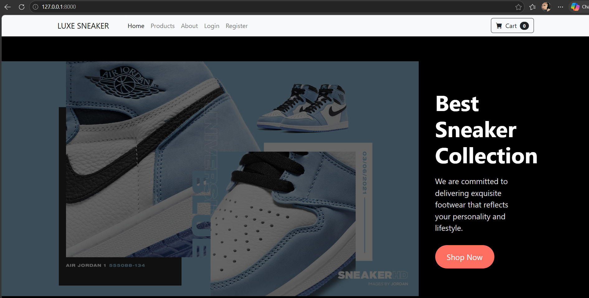
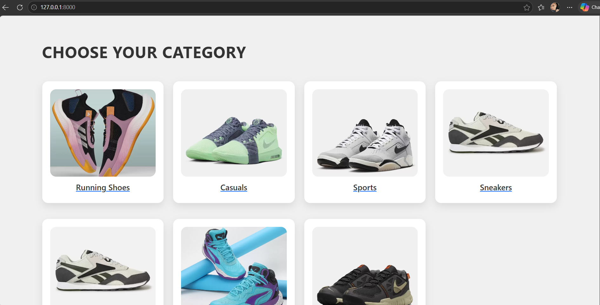
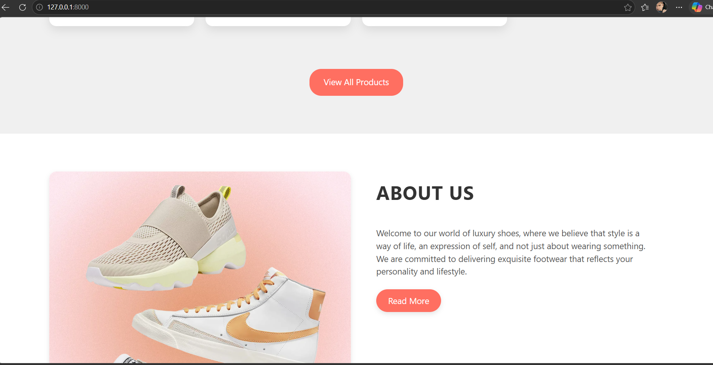
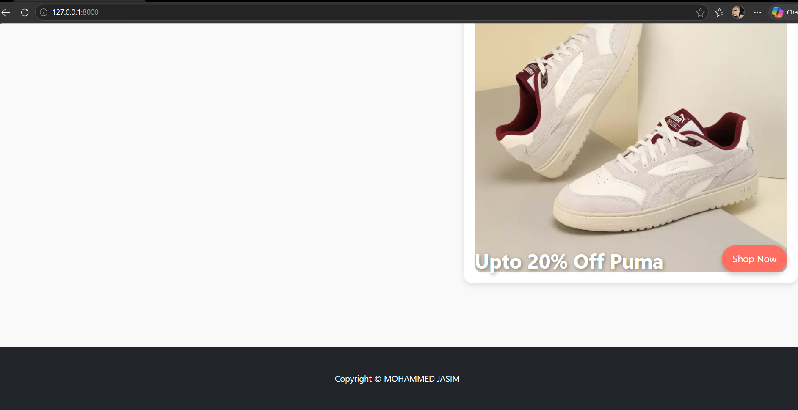
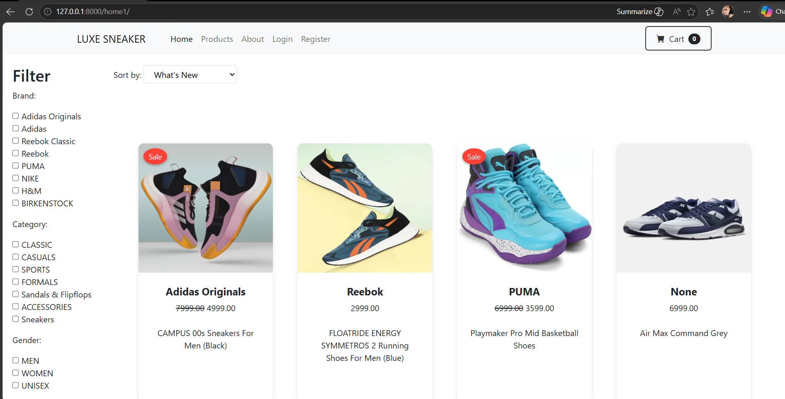
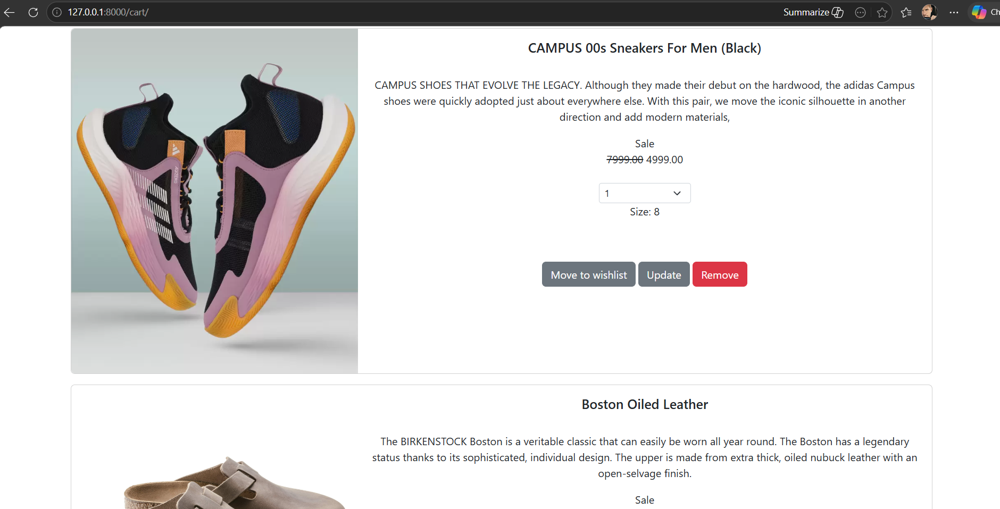
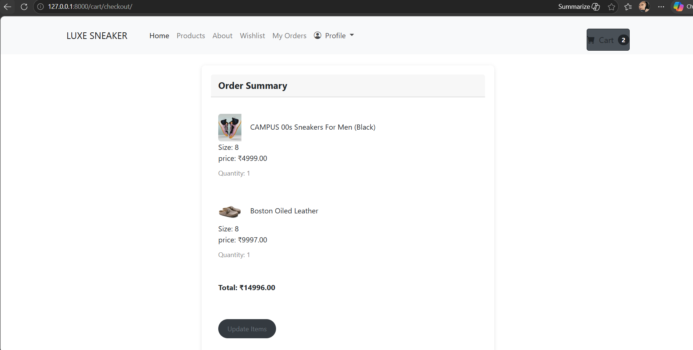
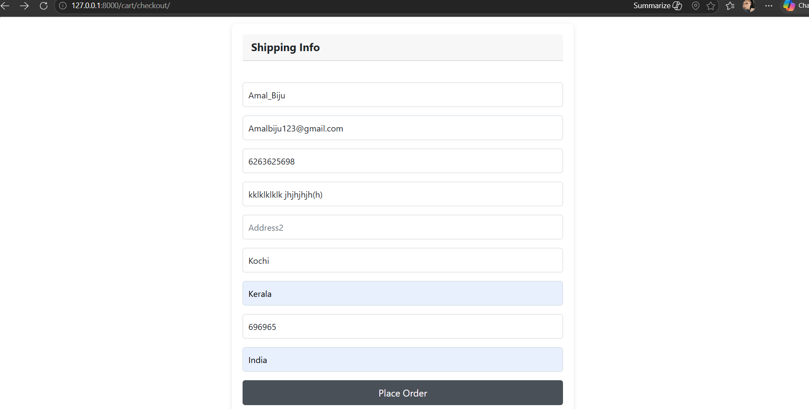
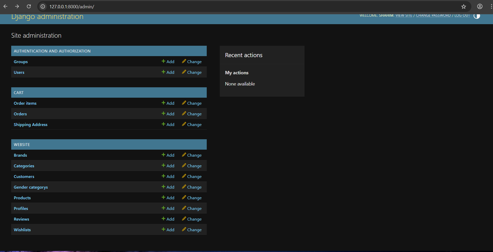

# Ecommerce WebApp Django

## Project Overview
A full-stack e-commerce web application developed using Django and MySQL.  
The project includes authentication, product management, cart functionality, checkout workflow, and an admin panel.

---

## Features
- User Registration & Login
- Product Listing
- Product Detail View
- Shopping Cart System
- Checkout Functionality
- Admin Dashboard
- Category-based Products
- Wishlist Functionality
- Review & Rating System

---

## 🛠️ Technologies Used
- Python
- Django
- MySQL
- HTML
- CSS
- Bootstrap

---

## Project Screenshots

### Home Page

### Products Page

### Cart Page

### Checkout Page

### Admin Panel

---

## Important Code Files
The repository includes important backend logic files inside the `important_code` folder:
- models.py
- views.py
- urls.py

---

## 🎯 Project Purpose
This project was developed to demonstrate:
- Full-stack web development using Django
- Database integration and CRUD operations
- Authentication and session handling
- E-commerce workflow implementation

---

## 👨‍💻 Author
**Mohammed Jasim**

- LinkedIn: https://www.linkedin.com/in/mohammed-jasim-b0371937a/
- GitHub: https://github.com/mohammed-jasim03
